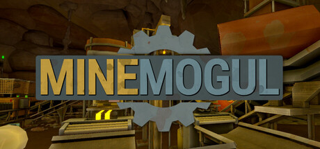

  <h1>Mine Mogule Project Patcher</h1>

  

  

    A game wrapper that generates a Unity project from Mine Mogule's build that can be playable in-editor
  

<a href="https://github.com/nomnomab/unity-project-patcher">Unity Project Patcher</a>
 · 
<a href="https://github.com/Kesomannen/unity-project-patcher-bepinex.git#update-mono-cecil">Unity Project Patcher BepInEx</a>

</h4>

 

# Table of Contents

- [About the Project](#about-the-project)
- [Getting Started](#getting-started)
- [Installation](#installation)
- [Usage](#usage)
- [FAQ](#faq)

## About the Project

This tool is a game wrapper on top of the [Unity Project Patcher](https://github.com/nomnomab/unity-project-patcher).

This takes a build of Mine Mogule, extracts its assets/scripts/etc, and then generates a project for usage in the Unity editor.

> [!IMPORTANT]  
> This tool does not distribute game files. It simply works off of your copy of the game!
>
> Also, this tool is for **personal** use only. Do not re-distrubute game files to others.

## Getting Started

Make sure you have the following before using the tool in any way:

- [Git](https://git-scm.com/download/win)
- [Unity 6000.3.5f2](https://unity.com/releases/editor/whats-new/6000.3.5f2)
- [.NET 9.0](https://dotnet.microsoft.com/en-us/download/dotnet/9.0)
  - To run Asset Ripper

## Installation

### Unity Project

Create a new Unity project using 3D Built-In Render Pipeline.

1. Open the Package Manager from `Window` > `Package Management` > `Package Manager`
2. Click the `+` button in the top-left of the window
3. Click `Add package from git URL`
4. Install the following 3 projects:

- Unity Project Patcher: `https://github.com/Rogue-source/Unity-Project-Patcher.git`
- Unity Project Patcher BepInEx: `https://github.com/Rogue-source/unity-project-patcher-bepinex.git`
- This project: `https://github.com/Rogue-source/mine-mogul-project-patcher.git`

### Patch and Configure BepInEx
- Go to `Tools` > `Unity Project Patcher` > `Configs` > `UPPatcherUserSettings`
- Change the Game Folder Path to your Mine Mogul directory
- Go to `Tools` > `Unity Project Patcher` > `Open Window`
- Press Enable BepInEx
- Press Run Patcher
- Unity will open and close a few times.
- Wait until the process finishes completely.

## Credits

Original files and project settings from [ZehsTeam](https://github.com/ZehsTeam). Remade for Mine Mogule.

## FAQ

**Q: How do I get rid of the "No cameras rendering" warning?**

Right click the `Game` window and uncheck the checkbox labeled "Warn if no cameras rendering";

---

For more questions, see core project's FAQ: https://github.com/nomnomab/unity-project-patcher#faq
